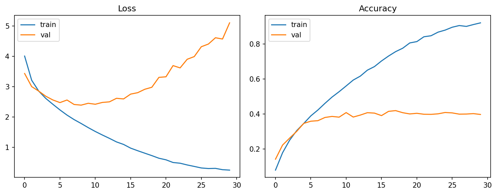
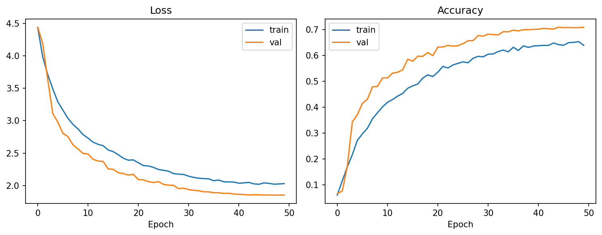
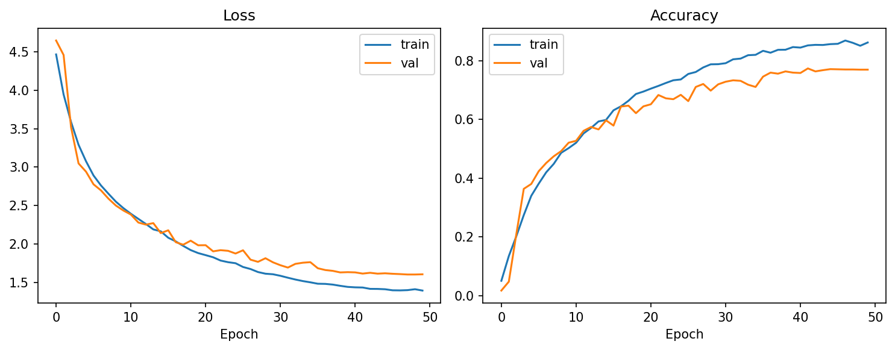

# 实验 1：卷积神经网络 CNN 图像分类

基于 PyTorch 的深度卷积神经网络在 Flower Recognition 数据集（102 类花卉）上的分类实验。

## 实验目的

理解并掌握基于卷积神经网络的图像分类任务。

## 实验环境

- **硬件**：x86_64 Centos 3.10.0 服务器/GPU 服务器/PC
- **软件**：Python 3.5+、Jupyter Notebook、PyTorch、Kaggle 数据集

## 实验原理

卷积神经网络（CNN）是一种前馈神经网络，人工神经元可以响应周围单元，适合进行大型图像处理。CNN 网络一共有 5 个层级结构：

1. **输入层** — 图像预处理（去均值、归一化、PCA 降维等）
2. **卷积层** — 局部感知 + 权值共享，使用卷积核提取特征
3. **激活层** — 非线性映射（ReLU / Sigmoid / Tanh / Leaky ReLU）
4. **池化层** — 特征降维、压缩参数、缓解过拟合（Max Pooling / Average Pooling）
5. **全连接 FC 层** — 分类输出（Softmax）

## 项目结构

```
exp/exp1/
├── cnn_flower_classification.py                  # 原始 baseline（2 卷积层 + 3 全连接）
├── cnn_flower_classification_optimized.py        # 优化版（5 卷积块 + BatchNorm + Dropout）
├── cnn_flower_classification_residual.py         # 残差版（ResNet 风格残差块）
├── cnn_flower_classification_optimized_changes.md
├── cnn_flower_classification_residual_changes.md
├── requirements.txt
└── experiment_outputs/
    ├── cnn_flower_py/                # 原始 baseline 结果
    ├── cnn_flower_optimized/         # 优化版结果
    └── cnn_flower_residual/          # 残差版结果
```

## 模型演进

### 原始 Baseline（CNN）

```
28×28 输入
  │
├─ Conv(3→24, 3×3, p=1) + ReLU + MaxPool(2×2)  → 14×14
├─ Conv(24→12, 3×3, p=1) + ReLU + MaxPool(2×2) → 7×7
  │
├─ Linear(12×7×7 → 196) + ReLU
├─ Linear(196 → 84) + ReLU
└─ Linear(84 → 102)
```

### 优化版（CNN Optimized）

```
224×224 输入
  │
├─ Conv(3→32, 3×3, BN, ReLU) + MaxPool → 112×112
├─ Conv(32→64, 3×3, BN, ReLU) + MaxPool → 56×56
├─ Conv(64→128, 3×3, BN, ReLU) + MaxPool + D2D(0.05) → 28×28
├─ Conv(128→256, 3×3, BN, ReLU) + MaxPool + D2D(0.10) → 14×14
├─ Conv(256→256, 3×3, BN, ReLU) + MaxPool + D2D(0.10) → 7×7
  │
├─ Dropout(0.4)
├─ Linear(256×7×7 → 512) + ReLU + Dropout(0.4)
└─ Linear(512 → 102)
```

### 残差版（CNN Residual）

在优化版基础上，将每个卷积块替换为 ResNet 残差块：

```
ResidualBlock:
  x ──► Conv(BN) → ReLU → Conv(BN) → Dropout
   ▲                                      │
   └─────── Shortcut (1×1 Conv 或 Identity) ─┘
                │
               ReLU → 输出
```

残差连接在加深网络的同时缓解梯度传播困难。

## 训练配置对比

| 配置项 | Baseline | Optimized | Residual |
|--------|----------|-----------|----------|
| 输入尺寸 | 28×28 | 224×224 | 224×224 |
| 归一化 | [0.5, 0.5, 0.5] | ImageNet 统计量 | ImageNet 统计量 |
| 数据增强 | 无 | 翻转/旋转/ColorJitter/RandomErasing | 同左 |
| 卷积块 | 2 | 5 + BN + D2D | 5 ResidualBlock + BN + D2D |
| 优化器 | Adam | AdamW + weight decay | AdamW + weight decay |
| LR 调度 | 固定 | CosineAnnealingLR | CosineAnnealingLR |
| 训练轮数 | 30 | 50 | 50 |
| 标签平滑 | 无 | 0.1 | 0.1 |
| 梯度裁剪 | 无 | 1.0 | 1.0 |
| 模型保存 | 最后模型 | Best + Last | Best + Last |

## 训练结果对比

### 损失与准确率曲线

**原始 Baseline** — 训练损失持续下降（0.3→0.2），验证损失在 epoch 5 后开始反弹，验证准确率停在 ~0.4，典型过拟合。



**优化版** — 训练和验证损失同步平稳下降，验证准确率提升至 ~0.71，过拟合大幅缓解。



**残差版** — 验证准确率进一步提升至 ~0.76，残差连接帮助更深网络稳定训练。



### 混淆矩阵

优化版与残差版的混淆矩阵对角线明显增强，表明多类花卉识别正确率显著提升：

| | Baseline | Optimized | Residual |
|---|---------|-----------|----------|
| 最佳验证准确率 | ~40% | ~71% (epoch 45) | ~76% (epoch 48) |

## 快速开始

### 环境准备

```bash
# 查看 requirements.txt
cat exp/exp1/requirements.txt

# 安装依赖
pip install torch torchvision matplotlib numpy Pillow
```

### 运行 Baseline

```bash
python exp/exp1/cnn_flower_classification.py \
  --data-dir data/flowers \
  --epochs 30 \
  --batch-size 20 \
  --learning-rate 1e-3
```

### 运行优化版

```bash
python exp/exp1/cnn_flower_classification_optimized.py \
  --data-dir data/flowers \
  --epochs 50 \
  --batch-size 32
```

### 运行残差版

```bash
python exp/exp1/cnn_flower_classification_residual.py \
  --data-dir data/flowers \
  --epochs 50 \
  --batch-size 32
```

### 快速检查模型结构

```bash
python exp/exp1/cnn_flower_classification_optimized.py --smoke-test
```

## 输出文件说明

| 文件 | 说明 |
|------|------|
| `fig_baseline_loss_acc.png` | Baseline 训练/验证 Loss 与 Accuracy |
| `fig_optimized_loss_acc.png` | Optimized 训练/验证 Loss 与 Accuracy |
| `fig_residual_loss_acc.png` | Residual 训练/验证 Loss 与 Accuracy |
| `fig_best_confusion_matrix.png` | 最佳验证集混淆矩阵热力图 |
| `best_confusion_matrix.csv` | 混淆矩阵 CSV 数据 |
| `summary.json` | 实验配置、最佳准确率、每类准确率 |
| `cnn_baseline.pt` | Baseline 模型权重 |
| `cnn_optimized_best.pt` | Optimized 最佳模型 |
| `cnn_residual_best.pt` | Residual 最佳模型 |
