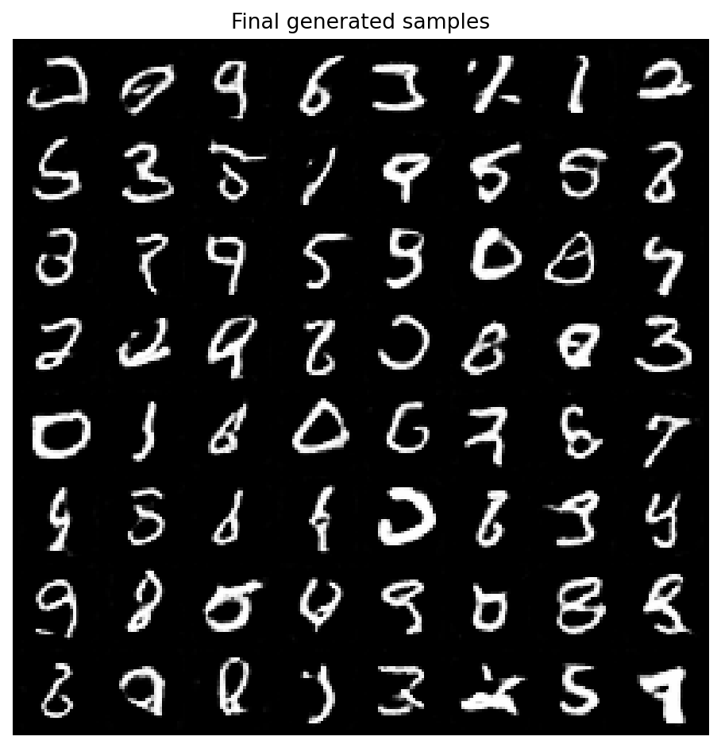
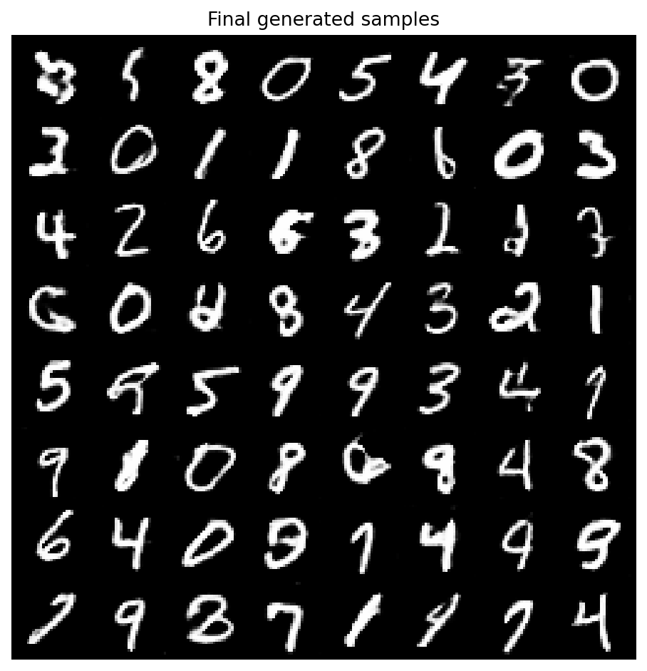
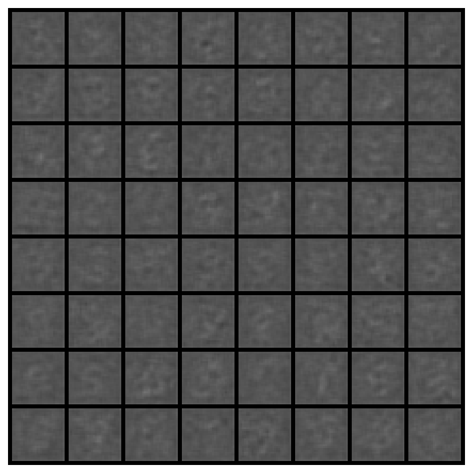
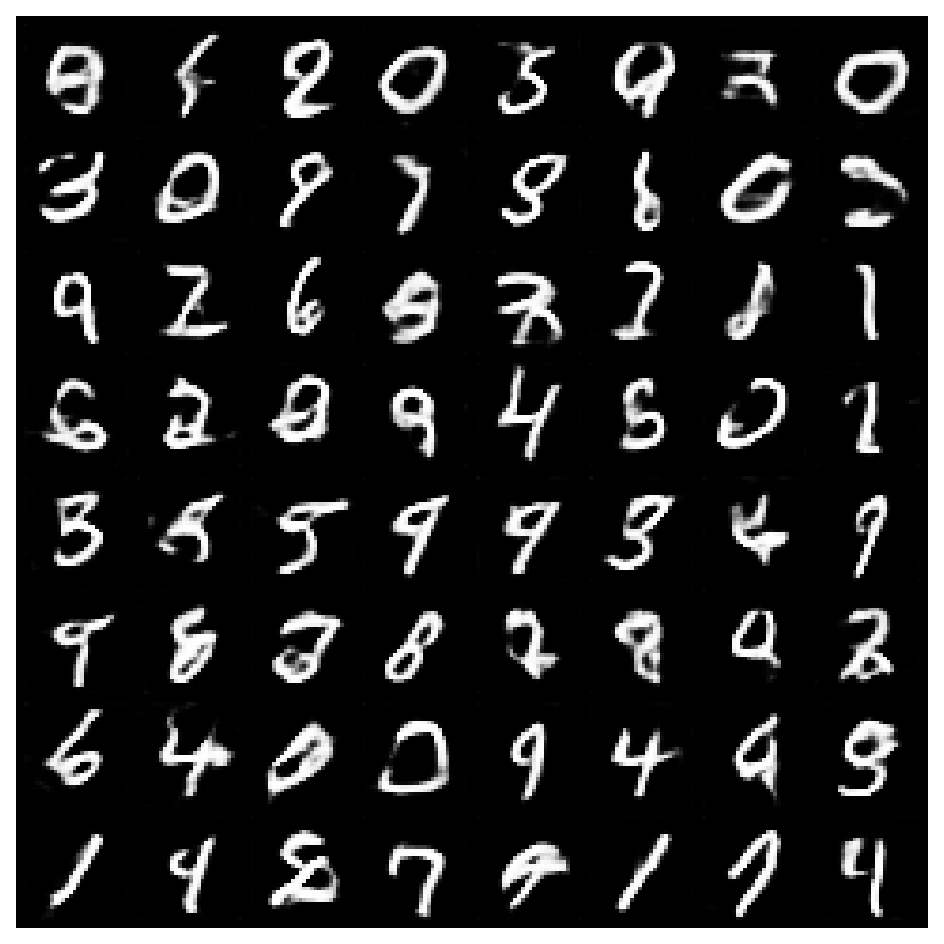
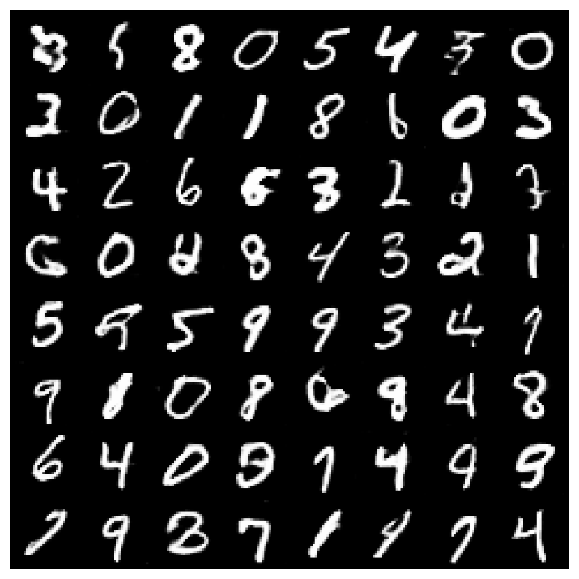
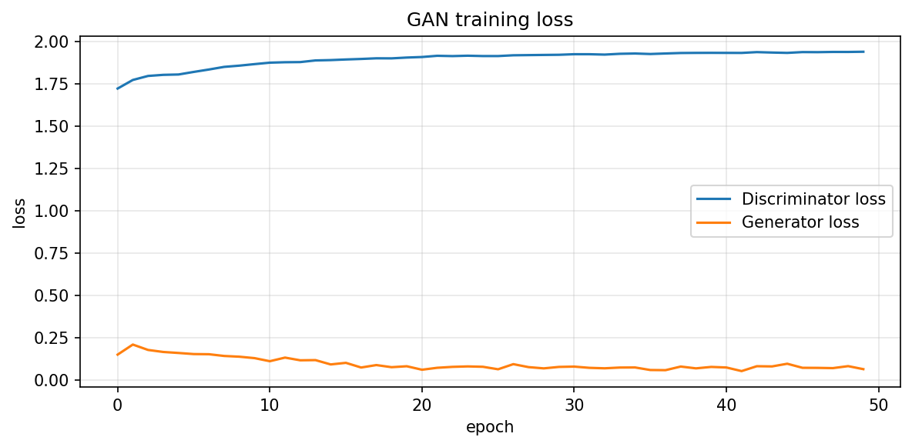
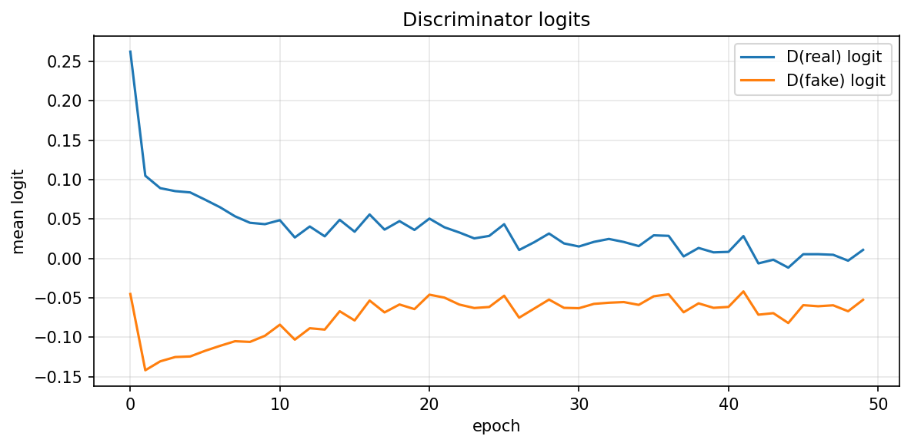

# 实验 3：生成对抗网络 GAN 及 DCGAN 实验

基于深度卷积网络的生成对抗网络（DCGAN）在 MNIST 手写数字数据集上的实现与优化。

## 实验目的

- 学习生成对抗网络（GAN）和深度卷积生成对抗网络（DCGAN）的基本原理
- 利用 DCGAN 实现 MNIST 数字手写体图像生成
- 分析 BIGGAN 网络，对比 DCGAN 与 BIGGAN 的异同

## 实验环境

- **硬件**：x86_64 Centos 3.10.0 服务器/GPU 服务器/PC
- **软件**：PyTorch 1.x+、Python 3.8+

## 项目结构

```
exp/exp3/
├── dcgan_biggan_mnist.py              # 原始 DCGAN 实现（实验任务书 baseline）
├── dcgan_mnist_improved.py            # 三阶段优化版 DCGAN
├── dcgan_mnist_improved_modification_notes.md  # 优化修改说明
├── data/                              # MNIST 数据集
└── experiment_outputs/                # 训练输出
    ├── dcgan_mnist_py/                # 原始 baseline 结果
    └── dcgan_mnist_improved/          # 优化版结果
```

## 原始 DCGAN

`dcgan_biggan_mnist.py` 是实验任务书中定义的基础实现，包含：

- 生成器：3 层 `ConvTranspose2d` + BN + ReLU，最后一层 `Conv2d` + Tanh
- 判别器：2 层 `Conv2d` + BN + LeakyReLU，最后一层 `Linear`
- 损失函数：BCE (软标签 0.9)
- 默认训练 10 个 epoch，batch_size=128，noise_dim=100

## 优化版 DCGAN

`dcgan_mnist_improved.py` 围绕三个阶段完成优化：

| 阶段 | 优化内容 | 关键改进 |
|------|---------|---------|
| **阶段 1** | 超参数与训练流程 | 50 epoch、noise_dim=128、独立 G/D 学习率、实例噪声 |
| **阶段 2** | 网络结构 | Upsample+Conv 替代反卷积、Strong Discriminator、SpectralNorm、Dropout |
| **阶段 3** | 损失函数 | Hinge Loss 替代 BCE、标签平滑、EMA、条件生成、数据增强 |

### 生成器架构

```
Upsample 模式（默认）:
  noise(128) → Linear → 64×7×7 → Upsample+Conv → 128×14×14 → Upsample+Conv → 1×28×28

Deconv 模式:
  noise(128) → ConvTranspose2d → ConvTranspose2d → ConvTranspose2d → 1×28×28
```

### 判别器架构

- **Basic**（原始风格）: 2 层 Conv + LeakyReLU
- **Strong**（默认）: 3 层 Conv (SpectralNorm) + LeakyReLU + Dropout

## 训练结果对比

### 生成图像质量

**原始 Baseline（10 epoch, BCE）：** 数字轮廓开始出现，但边缘模糊，部分数字难以辨认。



**优化版（50 epoch, Hinge + Strong D）：** 数字结构清晰，笔画边缘平滑，10 个类别均覆盖良好。



### 训练过程可视化

训练从第 1 个 epoch 的纯噪声，到第 10 个 epoch 出现数字雏形，再到第 30-50 个 epoch 生成清晰的数字图像：

| 第 1 epoch | 第 10 epoch | 第 50 epoch |
|-----------|------------|------------|
|  |  |  |

### 损失曲线

优化版训练损失稳定下降：判别器损失收敛至 ~1.94，生成器损失收敛至 ~0.06。



判别器 logits 趋势显示 D(real) 和 D(fake) 差距逐渐缩小，表明判别能力趋于平衡：



## 快速开始

### 环境准备

```bash
# 使用 conda
conda env create -f ../environment.yml
conda activate deep_learning

# 或 pip
pip install -r requirements-dl-exp3.txt
```

### 运行原始 Baseline

```bash
python exp/exp3/dcgan_biggan_mnist.py \
  --epochs 10 \
  --batch-size 128 \
  --noise-dim 100 \
  --output-dir experiment_outputs/dcgan_mnist_py
```

### 运行优化版（推荐）

```bash
python exp/exp3/dcgan_mnist_improved.py
```

等价于：

```bash
python exp/exp3/dcgan_mnist_improved.py \
  --epochs 50 \
  --batch-size 128 \
  --noise-dim 128 \
  --generator-mode upsample \
  --discriminator strong \
  --loss hinge
```

### 完整功能版本（条件生成 + 数据增强 + 分类器评估）

```bash
python exp/exp3/dcgan_mnist_improved.py \
  --epochs 50 \
  --batch-size 128 \
  --noise-dim 128 \
  --conditional \
  --augment \
  --eval-classifier
```

### 复现实验任务书 Baseline

```bash
python exp/exp3/dcgan_mnist_improved.py \
  --epochs 10 \
  --noise-dim 100 \
  --generator-mode deconv \
  --discriminator basic \
  --loss bce \
  --no-ema \
  --instance-noise 0
```

## 输出文件说明

| 文件 | 说明 |
|------|------|
| `snapshot_epoch_xxx.png` | 每隔 epoch 保存的生成样本图 (8x8 grid) |
| `generated_final.png` | 最终生成样本 |
| `fig_train_loss.png` | 生成器/判别器损失曲线 |
| `fig_discriminator_logits.png` | 判别器对真实/生成样本的平均 logit |
| `history.npz` | 训练历史数据（D_loss, G_loss, logits） |
| `generator.pt` | 最终生成器权重 |
| `generator_ema.pt` | EMA 生成器权重 |
| `summary.json` | 实验配置与最终指标 |

## 消融实验建议

| 实验编号 | 设置 | 目的 |
|---------|------|------|
| Exp-0 | 原始 BCE + basic D + deconv G | baseline |
| Exp-1 | epoch 10 → 50 | 验证训练充分性 |
| Exp-2 | strong D + SpectralNorm | 验证判别器稳定化效果 |
| Exp-3 | Hinge Loss | 验证损失函数改进 |
| Exp-4 | Upsample Generator | 验证生成器结构改进 |
| Exp-5 | EMA | 验证采样稳定性提升 |
| Exp-6 | Conditional DCGAN | 验证类别一致性 |
| Exp-7 | Conditional + Augment + Eval | 最终推荐版本 |

## BIGGAN 演示

如需运行 BigGAN 预训练模型演示（需额外安装 `pytorch_pretrained_biggan`）：

```bash
python exp/exp3/dcgan_mnist_improved.py --biggan-demo
```
